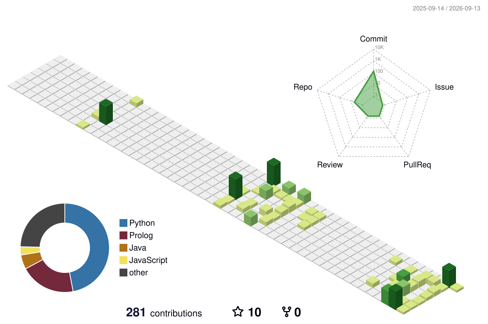

  <h1>Hi there, I'm Shivang! 👋</h1>
  <h3>B.Tech Student | AI & ML Enthusiast | Developer</h3>
  

---

### 🚀 About Me
- 🎓 I'm currently studying **Computer Science and Engineering (AI & ML)** at **VIT Bhopal University**.
- 🔭 **Current Focus:** Architecting a multi-layered, hyper-local cybersecurity engine to neutralize localized phishing threats.
- 🌱 **Currently Learning/Exploring:** Deepening my understanding of Python, exploring practical applications in AI, and mastering core Java, C, and OpenCV.
- 🎯 **Goals:** Actively looking to collaborate on impactful open-source projects and build real-world AI solutions.

---

### 🏆 Achievements
- 🥋 **National Karate Champion 2023**

---

### 💻 Tech Stack & Tools

**Languages**  

  
  
  
  
  
  

**Web Development & Databases**

  
  
  
  
  

---

### 📂 Featured Projects

| Project | Description | Tech Stack |
| :--- | :--- | :--- |
| **Abhedya** | AI-driven web security browser extension engine designed for hyper-local phishing detection. | `Python`, `FastAPI`, `ML` |
| **Iksha** | Real-time smart face-recognition attendance logging system developed for academic case studies. | `Python`, `OpenCV`, `face_recognition` |
| **Project Bermuda** | Graph-based modeling and traversal implementation of a battle royale map layout using logic programming. | `Prolog` |
| **Eureka Club** | Backend architecture and relational database structure design for the Eureka club's website platform. | `Backend`, `Database Design` |

---

### 📊 GitHub Stats

  
  

 

  

---

### 💡 Daily Tech Quote

  

---

### 📫 Let's Connect!

  
  

